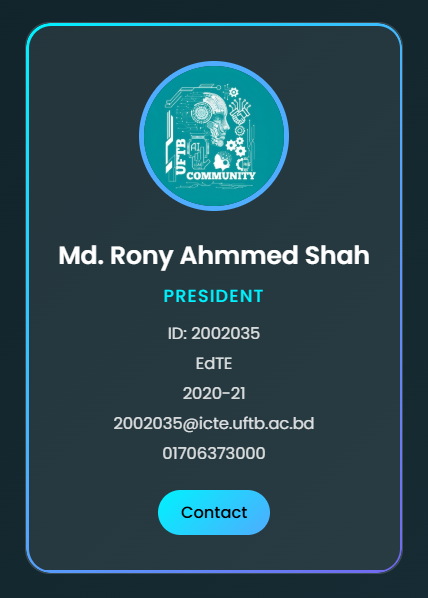

# University of Frontier Technology, Bangladesh (UFTB) AI Community Committee 2025-26 Directory with Active Members

Official Committee Directory Website for  
**University of Frontier Technology, Bangladesh (UFTB) – AI Community**

A modern, responsive, AI-themed committee member directory that dynamically loads data from Google Sheets and displays it in a beautiful glassmorphism card layout.

---

## 🌐 Live Features

✅ Dynamic Data Loading from Google Sheets  
✅ Auto JSON Conversion (No Backend Required)  
✅ Modern Glassmorphism Card Design  
✅ Responsive Grid Layout  
✅ Live Search Filter (Name, Post, Department)  
✅ Professional AI-Themed UI  
✅ Mobile Friendly  

---

## 🛠️ Technologies Used

- HTML5
- CSS3 (Glassmorphism + Gradient UI)
- Vanilla JavaScript
- Google Sheets (as Database)
- Google Visualization API (gviz JSON)

---

## 📊 Data Source (Google Sheets)

This project uses a public Google Sheet as a database.

### Required Column Order:

| Index | Column Name |
|--------|-------------|
| 0 | Post |
| 1 | Name |
| 2 | ID |
| 3 | Dept. |
| 4 | Session |
| 5 | Email |
| 6 | Mobile |

---
## card


## 🔗 Google Sheets JSON API Format

```javascript
https://docs.google.com/spreadsheets/d/YOUR_SHEET_ID/gviz/tq?tqx=out:json


```

## Live Demo
[Live Demo Link](https://rony7s.github.io/UFTB-AI-Community-Directory)